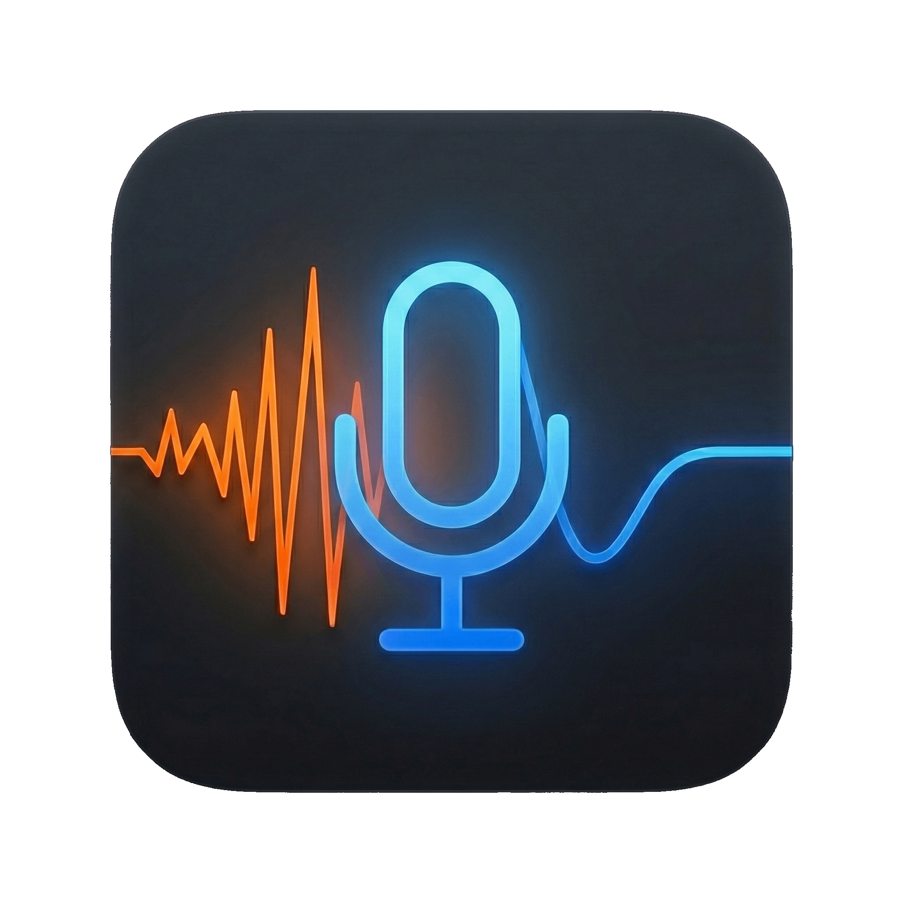

<div align="center">

  

  # NoNoise Mac

  ### Real-time, on-device AI noise cancellation for macOS

  Silence keyboards, fans, traffic, and room echo on **any** mic, in **every** app —
  processed entirely on your Apple Silicon Neural Engine. No cloud. No subscription. No lag.

  [](https://developer.apple.com/swift/)
  [](https://www.apple.com/mac/)
  [](#-privacy)
  [](LICENSE)
  [](https://github.com/ivalsaraj/NoNoise-Mac/actions/workflows/ci.yml)

  <a href="#-install"><b>Install</b></a> ·
  <a href="#-why-nonoise-mac"><b>Why</b></a> ·
  <a href="#-usage"><b>Usage</b></a> ·
  <a href="#-how-it-works"><b>How it works</b></a> ·
  <a href="#-contributing--ai-native"><b>Contribute</b></a>

</div>

<br />

> [!IMPORTANT]
> **Requires a Mac with Apple Silicon (M1 / M2 / M3 / M4 or newer).** NoNoise Mac runs the
> model on the Apple Neural Engine + Metal. It does **not** support Intel Macs.

---

## 🎯 What is NoNoise Mac?

NoNoise Mac is a lightweight **menu-bar app** that cleans your microphone in real time using
**DeepFilterNet3**, a state-of-the-art deep-learning speech-enhancement model, compiled to
**CoreML**. It strips background noise and de-reverberates "roomy" audio, then routes the
clean signal through a virtual audio cable so **Zoom, Meet, Discord, OBS, Slack, QuickTime —
anything** — hears studio-quality voice.

Everything happens **on your device**. Your audio never leaves your Mac.

## ✨ Why NoNoise Mac

- **🚫 Kills real-world noise** — fans, AC, keyboards, traffic, café chatter, crying kids.
- **🎙️ Studio clarity** — de-reverb removes echo so you sound close-mic'd and present.
- **⚡ Real-time feel** — a tight Metal/Accelerate pipeline keeps latency negligible for live calls.
- **🔒 100% private** — fully on-device on the Neural Engine; nothing is uploaded, ever.
- **🎛️ One-click modes** — Meeting, Podcast, Tutorial, or Custom, with strength + tone control.
- **🎙️ Broadcast Voice** — a one-tap clarity lift (Off / Low / Medium / High) that adds studio presence and tames sibilance, so you sound clearer and more present while still sounding like *you*.
- **🎧 Clean Incoming / Guest** — de-noise the *other* side too. Route a noisy guest or caller through a loopback device and NoNoise Mac cleans **what you hear** in real time with the same on-device AI — no cloud, no subscription.
- **🛠️ Works everywhere** — any input (Built-in, USB, XLR via interface) → any app via a virtual cable.
- **🟢 On by default** — launches actively cancelling noise; toggle from the menu bar anytime.
- **💸 Free & open source** — MIT licensed.

## 🧩 Modes

| Mode | Best for | Suppression | Voice Polish |
|---|---|---|---|
| **Meeting** | Calls / max noise removal | Full | Off (raw, uncolored) |
| **Podcast** | Warm, natural voice | Full, natural floor | On (warm) |
| **Tutorial** | Screen recordings | Full | On (clear/present) |
| **Custom** | Your own balance | Your `Strength` + `Reduction Limit` | On (balanced) |

Your selection (and any fine-tuning) is remembered between launches.

### 🎙️ Broadcast Voice

An optional clarity enhancement layered on top of any mode. It pairs a gentle, wide presence lift with an automatic de-esser, so added "air" never becomes harsh sibilance. **Off** by default; **Low / Medium / High** increase the effect. It is designed to be transparent — a peaking bell with unity gain at the low end and a de-esser that only acts on real "ess" sounds — so it preserves the identity of your voice.

## 📥 Install

No notarized binary is shipped yet — building from source takes ~2 minutes on Apple Silicon.

**Prerequisites:** macOS 13+, Apple Silicon, and the Swift toolchain (Xcode or
[Swift.org](https://www.swift.org/install/macos/)).

```bash
git clone https://github.com/ivalsaraj/NoNoise-Mac.git
cd NoNoise-Mac
./install-app.sh            # optimized arm64 build → /Applications/NoNoiseMac.app
```

`install-app.sh` runs `swift build -c release --arch arm64`, bundles/signs the app, and installs it
to **Applications**. To build the app and stage the virtual mic driver in one pass:

```bash
./install-app.sh --with-driver
```

Then:

1. First launch: **right-click → Open** (it's ad-hoc signed). If macOS blocks it, go to
   **System Settings → Privacy & Security → Open Anyway**.
2. If you used `--with-driver`, install the staged driver with `sudo ./install-driver.sh`.

> Prebuilt releases will land on the [Releases page](https://github.com/ivalsaraj/NoNoise-Mac/releases) — ⭐ the repo to get notified.

Maintainers publish prebuilt assets by pushing a `v*` tag that points to a commit on `main`. The
release workflow uploads zipped `NoNoiseMac.app`, `NoNoiseMacCLI`, `NoNoiseMic.driver`, and checksums.

## 🚀 Usage

### NoNoise Mic (virtual microphone) — recommended

Build and install the bundled **NoNoise Mic** driver once, then any app can pick it directly —
no BlackHole, no system-default juggling.

```bash
./build-driver.sh          # compile + ad-hoc sign NoNoiseMic.driver
sudo ./install-driver.sh   # install to /Library/Audio/Plug-Ins/HAL, restart coreaudiod, verify
```

Installing restarts `coreaudiod`, so **all** audio drops for ~3 s. Then:

1. **Launch** NoNoise Mac — the **NoNoise logo** appears in your menu bar.
2. **Input** — set **Input Device** to your real microphone (Built-in, USB, etc.). Output is
   **automatic**: the app routes cleaned audio to the hidden "NoNoise Mic Engine" and the popover
   shows **Output: Automatic → NoNoise Mic** (the Output **picker** only appears for the BlackHole
   fallback below).
3. **Point your apps at the mic** — in Slack / Zoom / Meet / Discord / OBS, set the
   **Microphone** to **NoNoise Mic**.
4. **Pick a mode** — Meeting / Podcast / Tutorial, or fine-tune **Suppression Strength** and
   **Reduction Limit** in Settings (this switches the mode to **Custom**).
5. Noise cancellation is **ON by default**. Toggle it anytime from the menu bar. Remove the
   driver later with `sudo ./uninstall-driver.sh`.

> **Gatekeeper and driver-load are different checks.** The *app* is ad-hoc signed (right-click →
> Open on first launch). The *driver* is loaded by `coreaudiod`, which **silently ignores** a
> plug-in with an invalid signature — `install-driver.sh` verifies the device actually appeared.

### Fallback: BlackHole virtual cable

If you can't install the driver (e.g. a managed Mac), NoNoise Mac also works with a
**[BlackHole 2ch](https://github.com/ExistentialAudio/BlackHole)** virtual cable:

1. **Launch** — find the **NoNoise logo** in your menu bar.
2. **Input** — set **Input Device** to your real microphone (Built-in, USB, etc.).
3. **Output** — set **Output Device** to **BlackHole 2ch** (the virtual cable).
4. **Point your apps at the cable** — in Discord / Zoom / OBS, set the **Microphone** to
   **BlackHole 2ch**.
5. **Pick a mode** and toggle as above — noise cancellation is **ON by default**.

### 🎧 Clean Incoming / Guest (hear them clean)

NoNoise Mac can also clean the **other** side of a call — a guest on a noisy laptop mic, or a
caller with a fan running — so **you** hear them de-noised in real time.

macOS has no built-in per-app audio loopback, so you route the call app's **output** into a
loopback device first, then NoNoise Mac captures and cleans it:

1. Install **[BlackHole 2ch](https://github.com/ExistentialAudio/BlackHole)** (or Loopback).
2. In your call app (Zoom / Meet / Discord), set the **speaker / output** to **BlackHole 2ch**.
3. In NoNoise Mac **Settings → Clean Incoming / Guest**, enable it, pick **BlackHole** as
   *Incoming from* and your real **speakers / headphones** as *Hear on*.

NoNoise Mac re-plays the **cleaned** guest audio to your chosen output, so you still hear the
call — just de-noised. It runs a **second** on-device AI stream and is **off by default** (that
stream only runs while enabled). For raw monitoring alongside the cleaned feed, point the call app
at a macOS **Multi-Output Device** that includes both the loopback and your speakers.

## 💻 Advanced: dual pipelines (CLI)

Want to clean your **outgoing mic** *and* clean **incoming** audio from your headphones at the
same time? Use the bundled `NoNoiseMacCLI`. Device names match those shown in the menu-bar app's
**Input/Output** pickers (and macOS **System Settings → Sound**); the CLI also echoes the
input/output devices it detects on launch.

```bash
# Show usage and available flags
./NoNoiseMacCLI --help

# Terminal 1 — clean your microphone into the virtual cable
./NoNoiseMacCLI --in "Built-in Microphone" --out "BlackHole 2ch" --gain 1.0

# Terminal 2 — clean a captured meeting stream into your speakers
./NoNoiseMacCLI --in "Loopback Audio" --out "MacBook Pro Speakers" --gain 1.5
```

## 🔬 How it works

```
Microphone ─▶ Capture (48 kHz) ─▶ Ring buffer ─▶ STFT
                                                   │
                            DeepFilterNet3 (CoreML, Neural Engine)
                                                   │
                                ISTFT ─▶ Voice Polish (EQ · compressor · limiter)
                                                   │
                                             Virtual cable ─▶ your app
```

- **DeepFilterNet3** runs as a streaming UNet on CoreML (`computeUnits = .all`).
- A faithful STFT feature pipeline (ERB bands, complex-spec features) matches the reference
  model exactly — see [`AGENTS.md`](AGENTS.md) and [`CONCEPTS.md`](CONCEPTS.md).
- An optional **Voice Polish** chain (high-pass → shelves → compressor → limiter) adds tone
  and leveling for Podcast/Tutorial modes.

## 🔒 Privacy

NoNoise Mac is **100% on-device**. Audio is captured, processed by the local CoreML model,
and routed out — it is never sent off your Mac. There is no telemetry and no account.

## 🧰 Tech stack

- **App:** Swift 5.9, SwiftUI (menu-bar `MenuBarExtra`)
- **Audio:** AVFoundation, CoreAudio, AudioToolbox, Accelerate (vDSP)
- **AI:** CoreML + Metal, model `computeUnits = .all`
- **Model:** [DeepFilterNet3](https://github.com/Rikorose/DeepFilterNet) (streaming UNet)
- **Packaging:** Swift Package Manager + `bundle.sh` / `install-app.sh`

## 🤖 Contributing & AI-native

This repo is built to be worked on by **humans and AI agents** alike:

- [`AGENTS.md`](AGENTS.md) — architecture, build/test, and the non-negotiable DSP / real-time invariants.
- [`docs/agents/README.md`](docs/agents/README.md) — the **agent store**: a catalog of agents to invoke for DSP review, CoreML I/O auditing, releases, and more.
- [`docs/knowledge/`](docs/knowledge/INDEX.md) — compounding knowledge base (gotchas, decisions, timeline).
- [`CONCEPTS.md`](CONCEPTS.md) — domain glossary · [`CONTRIBUTING.md`](CONTRIBUTING.md) — how to contribute.

PRs welcome. Keep the default audio path behavior-preserving and the render thread allocation-free.

## 🙏 Credits & acknowledgements

- **Original project — [MetalVoice](https://github.com/Ghostkwebb/MetalVoice) by [Ghostkwebb](https://github.com/Ghostkwebb).** NoNoise Mac is a rebrand + AI-native restructuring of MetalVoice, used under the MIT License. Huge thanks for the original implementation and the CoreML DeepFilterNet integration.
- **[DeepFilterNet](https://github.com/Rikorose/DeepFilterNet)** by [Hendrik Schröter (Rikorose)](https://github.com/Rikorose) — the speech-enhancement model at the core of this app.
- **[BlackHole](https://github.com/ExistentialAudio/BlackHole)** by Existential Audio — the recommended virtual audio cable.
- **SF Symbols** by Apple — UI iconography.

## 📄 License

[MIT](LICENSE) © Ghostkwebb (original MetalVoice) · ivalsaraj (NoNoise Mac)

---

<div align="center">
  <sub>Built for macOS, on-device, with ❤️ — NoNoise Mac</sub>
</div>
