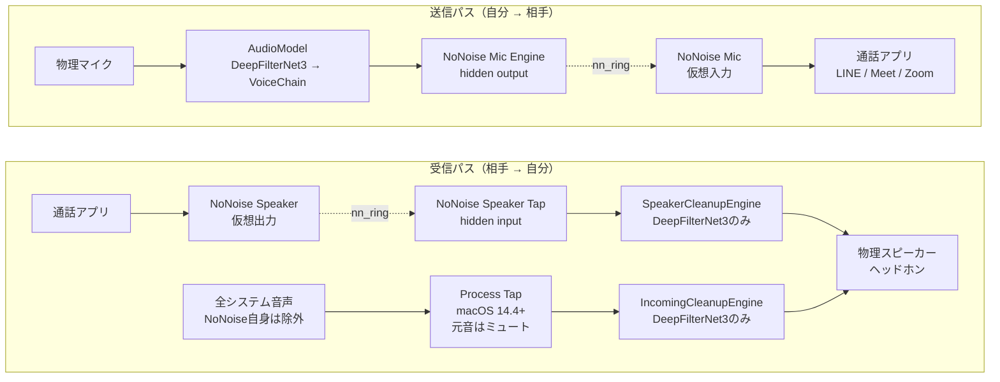
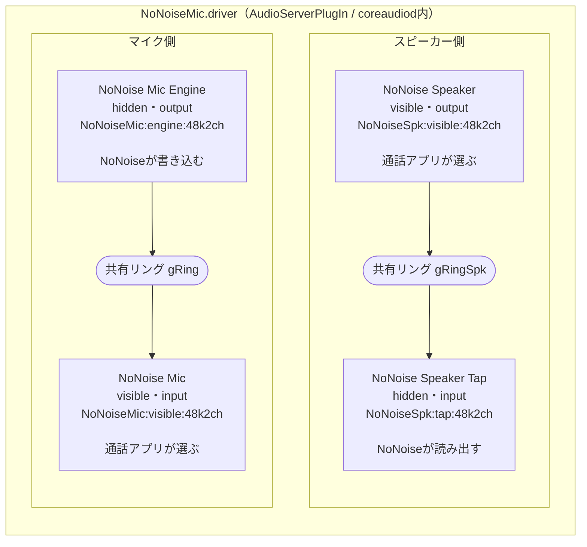
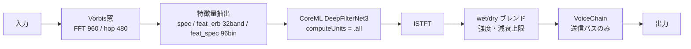

# NoNoise Mac（korezonzi fork）

**Krispの置き換え**として使う、Mac用の双方向AIノイズキャンセリングアプリ。
通話中のキーボード音・空調・生活音を、**完全オンデバイス**（Apple Neural Engine上のDeepFilterNet3）で除去します。クラウド送信なし・サブスク費用なし。

> 本リポジトリは [ivalsaraj/NoNoise-Mac](https://github.com/ivalsaraj/NoNoise-Mac)（MIT、MetalVoiceの後継）のフォークです。オリジナル開発者に感謝します 🙏

| | |
|---|---|
| 対応 | Apple Silicon Mac（M1以降）+ macOS 13以降。Intel Mac非対応 |
| 負荷 | CPU 約0.1%（Neural Engine実行）／ RSS 約65MB（Krispは3〜5%） |
| 外部依存 | なし（SPMパッケージ0件・モデルはリポジトリ同梱） |
| 通信 | なし。音声はMacの外に出ません |

---

## できること

ノイズ除去は3系統あります。送信は常時、受信は用途に応じて2方式から選びます。

| 方向 | 機能 | やること | 要件 |
|---|---|---|---|
| 自分 → 相手 | マイクのノイズ除去 | 通話アプリのマイクに **NoNoise Mic** を選ぶ | macOS 13+ |
| 相手 → 自分 | 通話アプリのみ（推奨） | 通話アプリのスピーカーに **NoNoise Speaker** を選ぶ | macOS 13+ |
| 相手 → 自分 | 全システム音声 | ポップオーバーでモードを切り替えるだけ。音楽など全ての音に掛かる | macOS 14.4+ |

受信の2方式は排他で、片方をONにすると他方は自動でOFFになります。

そのほか:

- ノイズ除去の強さは **自動 / 強 / 中 / 弱 / カスタム**。「自動」は環境ノイズ量を約30秒の指数移動平均で追跡し、強／中／弱を自動で切り替えます（ヒステリシス約3秒。現在の段はメニューバーに「自動（いま：中）」と表示）
- 声のクリア化（Broadcast Voice）・リップノイズ除去を、強さとは独立に段階指定
- グローバルホットキー8種（既定値）

| 操作 | キー |
|---|---|
| ノイズ除去のオン/オフ | ⌃⌥N |
| 生音と聴き比べ（長押し中だけ生音） | ⌃⌥B |
| 生音固定の切り替え | ⌃⌥⇧B |
| 強さを次へ / 前へ | ⌃⌥] / ⌃⌥[ |
| 声のクリア化を巡回 | ⌃⌥C |
| 出力ゲイン 上げ / 下げ | ⌃⌥= / ⌃⌥- |

---

## インストール

### チームメンバー向け（pkg・ビルド不要）

最新版の固定リンク: **https://github.com/korezonzi/NoNoise-Mac/releases/latest/download/NoNoiseMac.pkg**

ダウンロードした `NoNoiseMac.pkg` をダブルクリック。
未署名のため初回は macOS にブロックされます → **システム設定 > プライバシーとセキュリティ** を開き、下部の **「このまま開く」** をクリックしてから再実行してください（初回のみ。macOS 15 以降は右クリック→「開く」では回避できません）。

インストーラがアプリ（/Applications）と仮想オーディオドライバを一括導入します。**導入時に全音声が約3秒途切れます**（オーディオシステム再起動のため・正常です）。

自動更新はありません。新しい版が出たら同じ固定リンクから再ダウンロードしてください。
スクリーンショット付きの手順・トラブルシュートは [`docs/deploy/team-install.md`](docs/deploy/team-install.md)（社内向け Notion 版: https://app.notion.com/p/3e98b78a794481308fcdfdbb31216586 ）へ。

### ソースからビルド（開発者向け）

前提: Apple Silicon / macOS 13+ / Swiftツールチェーン（Xcode）

```bash
git clone https://github.com/korezonzi/NoNoise-Mac.git
cd NoNoise-Mac
./install-app.sh --with-driver   # release build → /Applications
sudo ./install-driver.sh         # 仮想デバイス導入（coreaudiod再起動・音声3秒断）
```

ad-hoc 署名のため初回起動はブロックされます。システム設定 > プライバシーとセキュリティ > 「このまま開く」で許可してください。

---

## 使い方

1. メニューバーの NoNoise アイコンをクリック → **ノイズ除去** がONであることを確認
2. 通話アプリでマイクを **NoNoise Mic** に切り替える
   - **LINE**: 設定 > 通話 > マイク
   - **Google Meet**: 設定（歯車）> 音声 > マイク
   - Zoom / Slack / Discord / OBS も同様
3. 相手側の雑音も消したい場合は **相手の音声もクリアに** をON
   - **通話アプリのみ（推奨）**: 通話アプリのスピーカー設定で **NoNoise Speaker** を選ぶ。この操作を忘れると何も清浄化されないため、動作中はポップオーバーに確認メッセージが出ます
   - **全システム音声**: 音楽やブラウザの音まで加工されます。初回ONで音声キャプチャの許可を求められます

トグルの表示は実際の稼働状態に連動します（開始に失敗した場合は「開始できませんでした」と原因が出るので、オフ/オンで再試行）。

---

## ⚠️ 運用上の注意

- **アプリを強制終了（`pkill` / アクティビティモニタからの強制終了）しない**こと。仮想デバイスの共有バッファが壊れ、以降マイクが無音になります。終了は必ずメニューバーの **終了** から
  - 壊れてしまったら: ターミナルで `sudo killall coreaudiod` → アプリ再起動で復旧
- **受信クリーンアップ（NoNoise Speaker / すべての受信音声）は、内蔵スピーカーで通話する構成と相性が悪い**。NoNoise の処理遅延が挟まるため通話アプリ側のエコーキャンセルが効かず、相手に自分の声が返る（エコー/ハウリング）原因になります。イヤホン使用時は問題なし。スピーカーで話すときは受信クリーンアップをオフにして、通話アプリの出力を通常のスピーカーに戻してください（該当状態のときはアプリ内の受信カードにも警告が出ます）
- アンインストール: `sudo ./uninstall-driver.sh` + /Applications からアプリ削除

---

## アーキテクチャ

### 音声フロー


```mermaid
%% 受信パスを先に定義しているのはレイアウト都合（送信パスが上に描画される）
flowchart LR
    subgraph IN["受信パス（相手 → 自分）"]
        direction LR
        APP2["通話アプリ"] --> SPK["NoNoise Speaker<br/>仮想出力"]
        SPK -. "nn_ring" .-> STAP["NoNoise Speaker Tap<br/>hidden input"]
        STAP --> SCE["SpeakerCleanupEngine<br/>DeepFilterNet3のみ"]
        SYS["全システム音声<br/>NoNoise自身は除外"] --> PTAP["Process Tap<br/>macOS 14.4+<br/>元音はミュート"]
        PTAP --> ICE["IncomingCleanupEngine<br/>DeepFilterNet3のみ"]
        SCE --> OUTDEV["物理スピーカー<br/>ヘッドホン"]
        ICE --> OUTDEV
    end

    subgraph OUT["送信パス（自分 → 相手）"]
        direction LR
        MIC["物理マイク"] --> AM["AudioModel<br/>DeepFilterNet3 → VoiceChain"]
        AM --> ENG["NoNoise Mic Engine<br/>hidden output"]
        ENG -. "nn_ring" .-> VMIC["NoNoise Mic<br/>仮想入力"]
        VMIC --> APP1["通話アプリ<br/>LINE / Meet / Zoom"]
    end
```

受信パスは声を整える `VoiceChain` を通しません。相手の音声は「自分の声を放送品質に寄せる」対象ではないためです。

### 仮想オーディオデバイス

`NoNoiseMic.driver` は `coreaudiod` 内で動く自作の **AudioServerPlugIn** です。BlackHole（GPL-3.0）には依存せず、Appleの公開API `<CoreAudio/AudioServerPlugIn.h>` に対する独自実装として MIT で配布しています。1つのプラグインが4デバイスを公開します。


```mermaid
%% スピーカー側を先に定義しているのはレイアウト都合（マイク側が左に描画される）
flowchart LR
    subgraph DRV["NoNoiseMic.driver（AudioServerPlugIn / coreaudiod内）"]
        subgraph S["スピーカー側"]
            direction TB
            SP["NoNoise Speaker<br/>visible・output<br/>NoNoiseSpk:visible:48k2ch<br/><br/>通話アプリが選ぶ"] --> R2(["共有リング gRingSpk"])
            R2 --> ST["NoNoise Speaker Tap<br/>hidden・input<br/>NoNoiseSpk:tap:48k2ch<br/><br/>NoNoiseが読み出す"]
        end
        subgraph M["マイク側"]
            direction TB
            E["NoNoise Mic Engine<br/>hidden・output<br/>NoNoiseMic:engine:48k2ch<br/><br/>NoNoiseが書き込む"] --> R1(["共有リング gRing"])
            R1 --> V["NoNoise Mic<br/>visible・input<br/>NoNoiseMic:visible:48k2ch<br/><br/>通話アプリが選ぶ"]
        end
    end
```

- フォーマットは 48kHz / 2ch / interleaved Float32 固定。各デバイスは `nn_clock`（ゼロタイムスタンプ方式・初回StartIOでアンカー）を持つ
- リングは **古い音声ではなく無音を返す**。`writeEnd` の監視で、アプリ側がまだ書いていないフレームや上書きされたフレームはゼロ埋めされる。アプリが描画を止めても、通話相手には直前の発言のループではなく無音が届く
- 危険なインデックス計算（`nn_ring` / `nn_clock`）はCoreAudio非依存のCに切り出し、デバイス無しでホストテスト可能

### DSPパイプライン


```mermaid
flowchart LR
    IN["入力"] --> W["Vorbis窓<br/>FFT 960 / hop 480"]
    W --> F["特徴量抽出<br/>spec / feat_erb 32band / feat_spec 96bin"]
    F --> ML["CoreML DeepFilterNet3<br/>computeUnits = .all"]
    ML --> IS["ISTFT"]
    IS --> BL["wet/dry ブレンド<br/>強度・減衰上限"]
    BL --> VC["VoiceChain<br/>送信パスのみ"]
    VC --> OUT["出力"]
```

`VoiceChain` の段順は ハイパス → 低域/高域シェルフ → プレゼンス → ディエッサー → ディプロシブ → ディクリック → コンプレッサー → リミッター。リミッターが最後で、天井へのハードクランプが最終的なオーバーフロー防止になります。各段は `Biquad`（RBJ係数・TDF-II）や自前のコンプレッサー／リミッターといった純粋な値型で、CoreML非依存のままユニットテストできます。

モデルは無改造の DeepFilterNet3（sr 48000 / fft 960 / hop 480 / 481 bins / 32 ERB bands / nb_df 96）で、libDF の特徴量パイプラインを再現しています。スペクトルの圧縮指数や出力の逆正規化は**入れてはいけません**（過去に混入して声がこもる不具合になった経緯があります。詳細は [AGENTS.md](AGENTS.md) の DSP invariants）。

---

## 技術スタック

| レイヤ | 使用技術 |
|---|---|
| アプリ | Swift 5.9 / SwiftUI（メニューバー常駐 `LSUIElement`）/ Swift Package Manager |
| 推論 | CoreML（`Resources/DeepFilterNet3_Streaming.mlmodelc`）を `computeUnits = .all` で Apple Neural Engine 実行 |
| 信号処理 | Accelerate / vDSP（DFT・窓関数・ダウンミックス）+ 自前の `Biquad` / `Compressor` / `Limiter` |
| オーディオ I/O | AVFoundation（`AVAudioEngine` / `AVAudioSourceNode`）・CoreAudio HAL・AudioToolbox |
| 仮想デバイス | 自作 AudioServerPlugIn（C11・`coreaudiod` 内で動作） |
| スレッド間ブリッジ | C11 atomics のロックフリー SPSC リング（`nn_ring` / `tap_ring`） |
| 受信音声の捕捉 | Core Audio Process Tap（`CATapDescription`, macOS 14.4+）／ 仮想スピーカー経由（13+） |
| システム統合 | ServiceManagement（`SMAppService` によるログイン時起動）・Carbon `RegisterEventHotKey`（追加権限なしでグローバルホットキー） |
| テスト | XCTest 282件（ヘッドレス）+ ドライバCコードのホストテスト |

リアルタイム音声スレッドの規律として、レンダーコールバック内ではヒープ確保・ロック・システムコールを行いません。スクラッチ領域と入力 `MLMultiArray` は初期化時に確保して使い回します。2つのリアルタイムスレッド（HALのIOProcとAVAudioEngineのレンダーブロック）を跨ぐ受け渡しは、優先度逆転を避けるため必ずロックフリーのSPSCリングを経由します。

---

## リポジトリ構成

| パス | 中身 |
|---|---|
| `Sources/Core` | エンジン本体（UIなし）。`AudioModel`・`AudioProcessing/*`・`VoicePreset`・`ControlLayer` |
| `Sources/App` | SwiftUIメニューバーアプリ。`NoNoiseMacApp`・`ContentView`（ポップオーバー）・`SettingsView`・`HotkeyManager` |
| `Sources/CLI` | `NoNoiseMacCLI`。ライブデバイス処理・`--action` ワンショット・`--denoise` オフラインファイル処理 |
| `Sources/CTapRing` | ロックフリーSPSCリングのCターゲット |
| `Driver/` | `NoNoiseMic.driver` のCソースとホストテスト（[Driver/README.md](Driver/README.md)） |
| `Resources/` | CoreMLモデル・アイコン・`Info.plist`・entitlements |
| `Tests/` | DSP・プリセット・制御ロジックのユニットテスト |

---

## 開発

```bash
swift build                          # debug
swift build -c release --arch arm64  # 最適化ビルド（bundle.sh の前提）
swift test                           # ユニットテスト282件（ヘッドレス）
Driver/tests/run-tests.sh            # ドライバCコードのホストテスト

./bundle.sh --with-driver            # .app + ドライバを生成（ad-hoc署名）
./install-app.sh --with-driver       # 上記 + /Applications へインストール
./build-pkg.sh                       # 配布用 NoNoiseMac-<ver>.pkg（bundle.sh の後に実行）
./build-driver.sh                    # ドライバのみビルド
```

ドキュメント:

| ファイル | 内容 |
|---|---|
| [AGENTS.md](AGENTS.md) | 開発ガイドの正本。アーキテクチャ・DSP不変条件・リアルタイム音声の規律。`CLAUDE.md` はここへの1行ブリッジ |
| [docs/DESIGN.md](docs/DESIGN.md) | フォークの設計判断・検証結果・ロードマップ |
| [CONCEPTS.md](CONCEPTS.md) | ドメイン用語集 |
| [Driver/README.md](Driver/README.md) | 仮想デバイスのトポロジと保証 |

---

## このフォークの変更点（vs upstream）

| 変更 | 理由 |
|---|---|
| NoNoise Speaker（仮想出力）と `SpeakerCleanupEngine` を追加 | 受信ノイズ除去を「通話アプリだけ」に限定するため。従来のprocess tap方式は音楽まで加工していた |
| メニューバーをNSStatusItem直接管理に変更 | macOS 26でMenuBarExtraがシステムに終了させられ、起動3秒で落ちる問題を回避 |
| bundle idを `com.korezonzi.NoNoiseMac.r2` に変更（2回目のローテーション） | macOS側のメニューバー管理DBがbundle id単位で「非表示」状態を保持し続け、アイコンが二度と表示されなくなる問題の回避。`com.ivalsaraj`→`com.korezonzi`→`.r2` と再発のたびにIDを替え、設定は自動引き継ぎ |
| プリセットを 自動/強/中/弱/カスタム に再設計 | 旧名（Meeting/Podcast/Tutorial）では何が変わるのか判別できなかった。あわせて環境追従の自動強度制御を追加 |
| UIを日本語化 | チーム配布のため。技術用語（LUFS・dBFS等）は原語のまま |
| Sparkle自動更新を除去 | SPMのバイナリ取得ハング回避 + git更新のため不要 |

### 実測値（2026-07-16 / Phase 0検証）

- 送信NC: 声の通過 max -19dB ／ ピンクノイズ 10dB減 ／ 静寂時はほぼ完全カット
  - 同条件でKrispは19dB減。定常ノイズの減衰量はKrispが優位で、声質は実通話で判断
- 受信NC: スピーカー出力のノイズを13〜17dB抑制
- 負荷: CPU 約0.1%（ANE実行）／ RSS 65MB

---

## ロードマップ

- [x] Phase 0-1: フォーク・実環境検証（LINE/Meet実通話でノイズ減を確認）
- [x] v2: NoNoise Speaker（通話アプリ単位の受信NC）／メニューバー一括ON/OFF／プリセット再設計・日本語UI
- [ ] チーム配布pkgの整備とセットアップ手順の文書化
- [ ] ノイズ種別の自動判別 → プリセット自動切替（SoundAnalysis の `SNClassifySoundRequest`）
- [ ] GTCRNとのA/B比較（`denoiser-rnd/` でCoreML変換とベンチ済み）
- 文字起こし+要約は**別アプリ**として検討（NCのリアルタイム処理と性質が異なるため。docs/DESIGN.md参照）

---

## ライセンス

MIT — original work © [ivalsaraj](https://github.com/ivalsaraj)（NoNoise Mac）/ [Ghostkwebb](https://github.com/Ghostkwebb)（MetalVoice）。fork changes © korezonzi。
